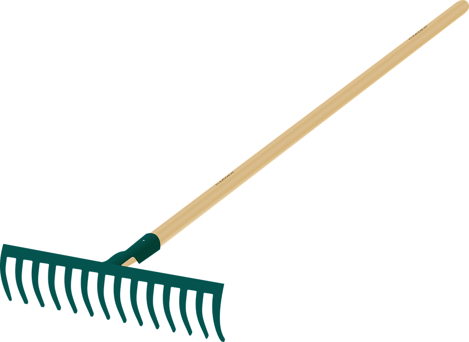

We're five weeks into bootcamp at [Craft Academy](http://www.craftacademy.se) and much less of programming seems like impenetrable magic. Servers? People like us set those up. Hackers? They pull up the console on websites and type away. But rake? What the heck is that thing that runs all the "tasks" and does things like combine Rspec and Cucumber results for Travis? It seems half the time you're having one of those horrendous "ugly" errors (seemingly endless lines of white code filled with paths to things you've never heard of), there's a problem with the Rakefile. A coach comes in and gives you a mysterious line of code to paste into that file and BOOM! Your deploy works now. WTF?

Let's investigate.

### What is rake?
Rake is a native tool for Ruby, similar to Unix's "make". Written by [Jim Weirich](https://en.wikipedia.org/wiki/Jim_Weirich), it is used to handle administrative commands or tasks, which are stored either in a Rakefile or in a `.rake` file. One can write their own rake tasks, specific to their application. There are rake tasks natively built into Ruby and Rails that perform common functions.

Rake is a Domain Specific Language (DSL), which means you can only use it for things related to Ruby. Rake allows one to write tasks in the Ruby language and execute them on the command line.

### What can you do with rake?
Anyone who has worked with Rails is familiar with database migrations:

```ruby
  rails db:migrate
  rake db:migrate
```
These are the same function, and rake is carrying out the task in either case. Imagine if you had to manually call all the migrations and make those adjustments to the database. Rake does that for you. This command will pull up a list of available rake functions in your environment:

```ruby
rake --tasks
```

###Rake uses Dependencies
Most of the code we write in Ruby is "imperative" -- that is, you write a function and then call it. If you want one function to run before another, you put it inside the first, like so:

```ruby
  def method_one
    # do a thing
  end

  def method_two
   method_one
   # do another thing
  end

  def method_three
   method_one
   # do a third thing
  end
```

Both `method_two` and `method_three` require method_one to be run first, but if you need to run `method_two` and `method_three`, you'll run `method_one` twice. Sometimes that's ok, but many times it's not. Rake gets around this problem by using an entirely different computational method: dependencies. Consider this block of code from inside the `cucumber.rake` task file. Anyone who is doing acceptance tests with Cucumber in Rails has one:

```ruby
namespace :cucumber do
  Cucumber::Rake::Task.new({:ok => 'test:prepare'},
  'Run features that should pass') do |t|
  t.binary = vendored_cucumber_bin
  t.fork = true
  t.profile = 'default'
end
[...]
desc 'Alias for cucumber:ok'
  task :cucumber => 'cucumber:ok'
  task :default => :cucumber
  task :features => :cucumber do
  STDERR.puts
end
```

All those hash rockets (`=>`) represent dependencies. The first method won't run until the second has. When there are multiple methods that rely on multiple other methods, Rake will actually make a decision for the programmer about which should run first, arranging it so that all the dependent methods are run after the methods they depend on.

###Writing Rake tasks
I can see my Bootcamp teachers cringing at that headline, so I'll preface this by saying: I'm in a branch I plan to dump and I promise not to do this in any code I keep without talking to you about it first. So, this all sounds great, right? And we want to write our own rake tasks to do things we might find tedious to keep typing over and over. Here we go! In Rails, you keep your custom Rake tasks inside `/lib/tasks/*.rake` . Check it:

```ruby
# /lib/tasks/play.rake

task :play do
  puts "Here's a rake task!"
end
```

Now we just call the task in our command line!

What about those dependencies?

```ruby
# /lib/tasks/play.rake

task :play do
  puts "Here's a rake task!"
end

task :raking => [:play] do
  puts "Should put this after :play"
end
```

Rake will run the "dependent" method after the first. If we complicate things by requiring two methods, the computer will decide which should go first. Rake can do nearly limitless, ridiculously complicated tasks to simplify our workflows. No doubt this is all outside of the scope of the bootcamp, but really exciting for our future as busy developers.

## Sources and further reading:

[Using the Rake Build Language](http://martinfowler.com/articles/rake.html), Martin Fowler  
[Rake Documentation](http://rake.rubyforge.org/)  
And promising FTP docs: [FtpUploader](http://ruby-doc.org/stdlib-2.0.0/libdoc/rake/rdoc/Rake/FtpUploader.html)
